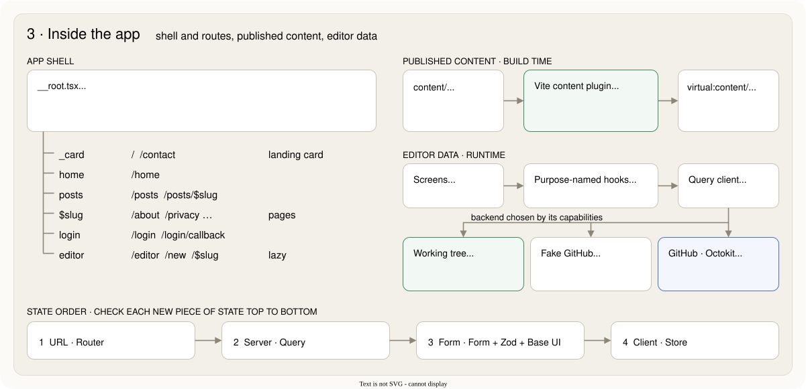
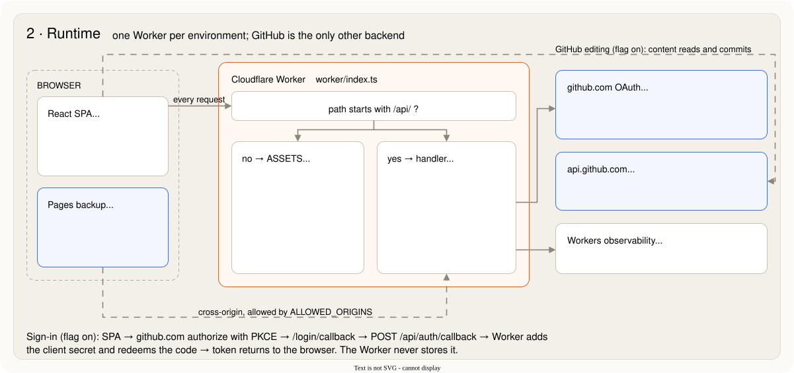
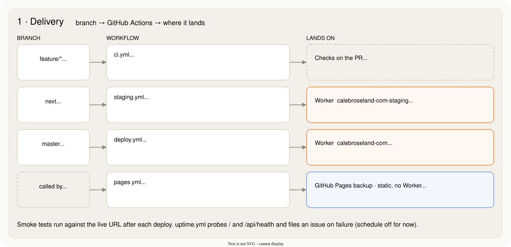
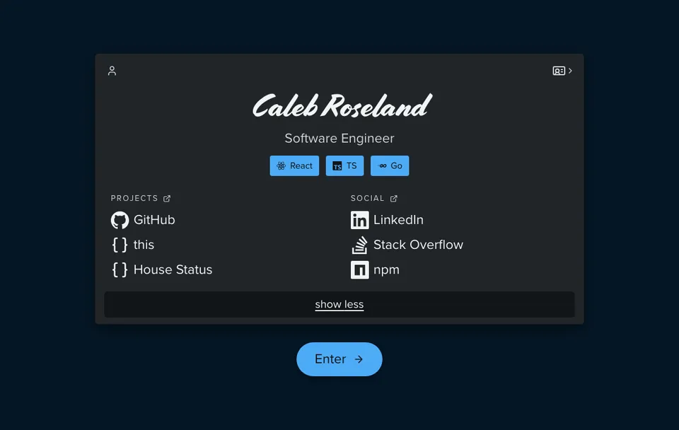
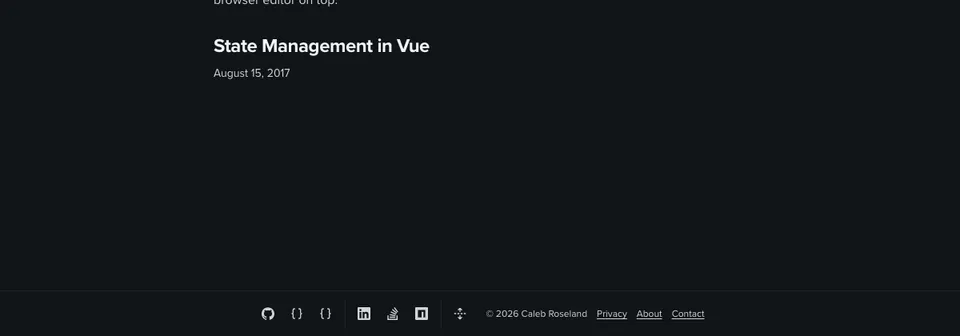

*If you haven't been here before: this site has been rebuilt from the ground up.*

The previous version was a landing page I hadn't touched in years. The hosting was spread across several vendors, and writing a post meant opening an editor, a terminal, and a deploy dashboard.

So I rebuilt it. Same goal as always: a small personal site that is *cheap to run* and *pleasant to write in*.

---

## The stack

`let crcom =` ***React 19 + TanStack (Router, Query, Form, Store) + Zod + a Cloudflare Worker + GitHub***

State goes in the first place that fits, in this order:

1. **URL** (TanStack Router). If it should survive a refresh or a shared link, it goes in the path or the search params.
2. **Server** (TanStack Query). Anything that comes from somewhere else: GitHub, the Worker, the files on disk.
3. **Form** (TanStack Form). What the user is typing, until they save it.
4. **Client** (TanStack Store). Whatever is left. There isn't much.

Persistent state is just *markdown in a git repo*. `content/` holds posts, pages, the profile and the theme. GitHub is the database, Cloudflare is the host, and both run on free tiers.



---

## Important details to consider

### Composition

*Small packages, one deployable*

There's one app (`apps/web`) and a handful of workspace packages: a design system, the content schemas, a markdown pipeline, a GitHub client, and a drag-and-drop wrapper.

The Worker is deliberately boring. It answers `/api/*` and nothing else; everything else is static assets. No server rendering, no database, nothing to keep warm.



💡 Every deploy also lands on GitHub Pages as a static backup, so a bad day at one host isn't a bad day for the site.

### Convenience

*One command to rule them all*

`mise` is the only entry point. `mise run setup`, `mise run dev`, `mise run check`. The same check runs as the pre-commit hook and in CI, so "works on my machine" and "passes CI" are the same sentence.

Vite 8 with the Cloudflare plugin runs the Worker in workerd locally, so dev looks like production.

Shipping follows the branch. A pull request runs the checks. A push to `next` deploys staging, and a push to `master` deploys production. Each deploy is smoke-tested against its live URL.



### Predictability

*Hooks with a purpose, outcomes instead of exceptions*

One rule keeps data flow easy to trace: **components only call purpose-named custom hooks.** `useState`, `useQuery`, `useNavigate` and friends live inside hooks like `useEntry(slug)` or `useSaveDraft()`. A lint rule enforces it.

Writes come back as typed outcomes rather than thrown errors:

```ts
const result = await save.run(draft);
if (!result.ok && result.reason === "conflict") {
  // someone else changed the file; show the reload prompt
}
```

The data layer says *what happened*. The screen decides what to say and where to go.

### Integrity

*Zod, TanStack Form, and Base UI*

The 2017 post spent a while on UI validation vs. API validation, with Vuelidate on one side and Js-Data schemas on the other. This time three libraries split the work, and none of them overlaps the others:

- **Zod** decides *what is valid*. Every content schema lives in one package.
- **TanStack Form** decides *when to check*: values, touched and dirty state, validate on blur, listeners on change.
- **Base UI** decides *how it's announced*: labelled, accessible fields that expose their state as data attributes (`data-invalid`, `data-touched`), so CSS styles the error without any `className` logic.

The payoff is that the editor and the build use the *same* schema. The post-details form hands its values to the `entry` schema on blur:

```ts
validators={{
  onBlur: ({ value, fieldApi }) =>
    check({ ...fieldApi.form.state.values, title: value }),
}}
```

and the build runs that schema over every file in `content/`. What the editor accepts is what the site will publish. An invalid post that slips past the browser still fails the build, with the file and field named.

Zod's messages are written for developers, so they don't go to the screen as-is. A small map turns a path like `groups.0.links.2.url` into something a person can act on: *"Use a full address (https://…) or a path on this site (/posts)."*

💡 The Worker checks its payloads with Zod too. One library covers validation from the build to the browser.

TypeScript is strict, with `noUncheckedIndexedAccess` and `exactOptionalPropertyTypes` on. It's louder at first, then quieter forever.

### Structure

*Tokens, layers, and not much else*

Styling is CSS Modules and custom properties: OKLCH color tokens, cascade layers, logical properties. Components use semantic tokens (`--color-text-muted`), never raw colors, so themes are just a different set of values.

Menus, dialogs, popovers, selects and sliders come from [Base UI](https://base-ui.com). It handles focus, keyboard and ARIA, and leaves every pixel to the tokens. Motion respects reduced-motion twice: once in CSS, once in JS.

### Continuity

*The card becomes the footer*

The landing page is a card of links. Everywhere else, those same links live in the footer. Entering the site doesn't swap one for the other. The card *turns into* the footer, and the brand link turns it back.



*Half speed, with the card expanded, in both directions.*

It's the browser's [View Transitions API](https://developer.mozilla.org/en-US/docs/Web/API/View_Transition_API), with no animation library involved.

#### How a view transition works

You hand the browser a function that changes the DOM:

```js
const transition = document.startViewTransition(() => updateTheDom());
```

The browser then works through four steps:

1. **Capture the old state.** It takes a picture of the page as it is now, and pauses rendering.
2. **Run your update.** The DOM changes underneath, out of sight. If the function returns a promise, the browser waits for it.
3. **Capture the new state.** This time it records live elements, not a still picture.
4. **Animate between them.** It builds a temporary layer of pseudo-elements on top of the page, runs CSS animations on it, and removes the layer when they finish.

That layer is a small tree:

```text
::view-transition
└─ ::view-transition-group(root)
   └─ ::view-transition-image-pair(root)
      ├─ ::view-transition-old(root)   ← the picture from step 1
      └─ ::view-transition-new(root)   ← the live page from step 3
```

By default the whole page is one group named `root`, and the browser cross-fades `old` into `new`. That's the plain fade you get with no CSS at all.

The interesting part is `view-transition-name`. Give an element a name, and it gets a group of its own. The browser looks for that name in both captures:

- **Found in both:** the group moves and resizes from the old box to the new one, while its pictures cross-fade. This is the morph.
- **Only in the old capture:** it fades out.
- **Only in the new capture:** it fades in.

Every part of that tree is a pseudo-element, so ordinary CSS animations control it: `animation-duration` on a group, a custom `@keyframes` on an `old` picture, and so on. Two rules follow from the matching. A name must be unique on the page at capture time. And the pictures are images, so resizing a group resizes its text unless you say otherwise.

The `transition` object also carries promises (`ready`, `finished`) for scripting around the animation. Same-page transitions like this one now work in Chromium, Safari and Firefox.

#### How the card uses it

**The update is a navigation.** It runs inside React's `flushSync`, so the new route has rendered before step 3. The router's own transition is turned off for this move (`viewTransition: false`), so only one transition runs.

**Names come and go.** Each card link and its twin in the footer share a name built from their position, such as `footer-icon-0-2`. Both pages carry these names as CSS variables, but they only take effect while `data-vt` is set on `<html>`. The helper sets it before the transition and removes it after, so names never collide the rest of the time:

```css
:root:is([data-vt="enter"], [data-vt="leave"]) .toFooter .linkIcon {
  view-transition-name: var(--vt-footer-icon);
  view-transition-class: footer-link;
}
```

**Icons and labels are separate pairs.** An icon is the same shape at both ends, so its group just moves and scales. A label would stretch, so its two pictures fade instead: the old text out over the first half, the new text in over the second. `view-transition-class` tags each kind (`footer-link`, `footer-label`), so one rule times all of them.

**Unpaired parts fade.** The card itself (its border and background) has no twin in the footer. It's only in the old capture on Enter, so it fades out. It's only in the new capture on the way back, so it fades in.

**Hidden is a size too.** A label the collapsed footer hides is still in the DOM, clipped to nothing. It still has a name, so the card's label morphs into that tiny box and vanishes. No special case needed.

**Opting out is free.** With reduced motion, or in a browser without the API, the helper skips `startViewTransition` and runs the update directly. The page changes instantly and nothing else differs.

The footer's own toggle uses the same mechanics. Collapsed, it's one row of icons. Expanded, it's a labelled column per group. Every link, group title, the toggle and the copyright line gets a name, so each one slides to its new place instead of the whole footer re-flowing. Captures are drawn at their natural size, aligned left (`object-fit: none`), so a link that gains its label reveals the text rather than stretching into it.



*Half speed, expand then collapse.*

The toggle sits at the bottom of the page, so the page stays pinned to its bottom edge while the footer grows or shrinks. The scroll lands before the browser takes its second snapshot, so the morph happens in place rather than jumping.

---

## The editor

The part I'm happiest with: posts can be written in the browser.

The editor is TipTap with markdown storage, so what it saves is what GitHub renders. Right now it edits the *working tree*: the real files in `content/` on whatever branch is checked out. A save is an unstaged change I commit myself, right beside any code change. If the file changed on disk while it was open, the save is refused instead of overwriting.

Editing through GitHub (draft branches, pull requests, merge to publish) is built and behind a flag while it settles. There's even a fake GitHub that runs in memory, so the whole workflow can be tested without an account.

---

## Every post has a history

Because the database is a git repo, version history comes free, and it's the real thing, not a `revisions` table someone could edit.

**One folder per post, forever.** A post is a folder under `content/posts/`, and folder names never change once created; the display slug lives in frontmatter instead. So `git log` on that folder is the post's complete history: every edit, who made it, when, and the exact diff. The 2017 post's [history on GitHub](https://github.com/calebroseland/calebroseland-com/commits/master/content/posts/2017/08-15-state-management-in-vue) starts with its import into v2.

**One door to `master`.** Changes reach the published branch through pull requests, and the checks must pass first. Each change lands as one commit with its PR number, so every version links back to its review and its CI run.

**Tamper-evident by design.** Every commit includes the hash of the one before it. Changing any earlier version of a post would change every hash after it, so the history can't be quietly rewritten.

**Traceable to the live site.** The build stamps the commit SHA into the Worker. `/api/health` reports it, and the post-deploy smoke test fails unless it matches the commit that was just deployed. Any page on the site traces back to exactly one commit.

---

## Takeaways

- Put state where it naturally lives, and write down the order.
- One schema beats two validators.
- Fewer vendors, fewer surprises.
- Make the boring path the only path: one command, one check, one place for each thing.

The libraries will change. Hopefully the ideas hold up.
